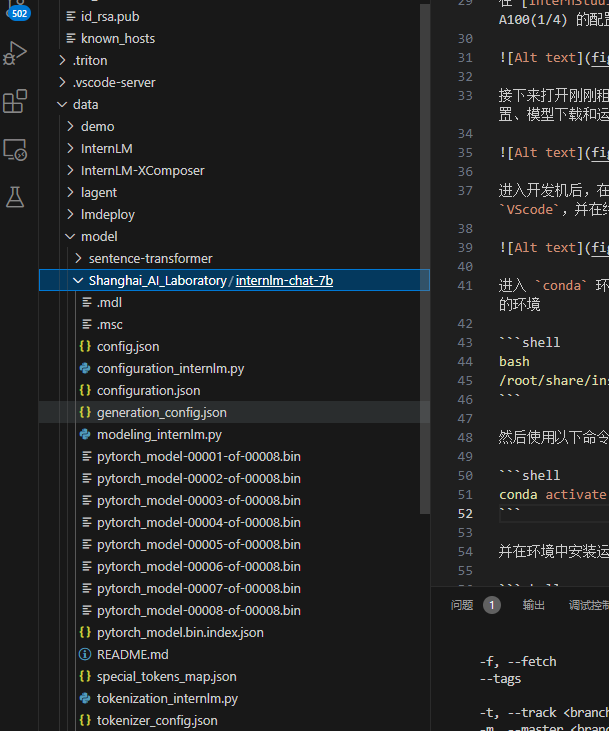

# 基于InternLM和Langchain搭建知识库
## 注意：很潦草的搭建方法，快速跑通的demo
## 1.环境搭建
### 踩过的坑（注意事项）：
有两种clone虚拟环境的方法

- > shell脚本一键克隆，后面参数是环境名称
    ```bash
    bash
    /root/share/install_conda_env_internlm_base.sh InternLM
    ```
- > conda命令克隆环境，注意环境名称
    ```bash
    conda create --name xtuner0.1.9 --clone=/root/share/conda_envs/internlm-base
    ```
### 下载依赖
```bash
# 升级pip
python -m pip install --upgrade pip

pip install modelscope==1.9.5
pip install transformers==4.35.2
pip install streamlit==1.24.0
pip install sentencepiece==0.1.99
pip install accelerate==0.24.1
```
## 2 下载模型
此处可以从hf,魔搭社区下载和share目录下

在本地的 /root/share/temp/model_repos/internlm-chat-7b 目录下已存储有所需的模型文件参数，可以直接拷贝到个人目录的模型保存地址：
```bash
mkdir -p /root/data/model/Shanghai_AI_Laboratory
cp -r /root/share/temp/model_repos/internlm-chat-7b /root/data/model/Shanghai_AI_Laboratory/internlm-chat-7b
```

在线下载，在 /root 路径下新建目录 data，在目录下新建 download.py 文件并在其中输入以下内容，粘贴代码后记得保存文件，如下图所示。并运行 python /root/data/download.py 执行下载，模型大小为 14 GB，下载模型大概需要 10~20 分钟
```bash 
import torch
from modelscope import snapshot_download, AutoModel, AutoTokenizer
import os
model_dir = snapshot_download('Shanghai_AI_Laboratory/internlm-chat-7b', cache_dir='/root/data/model', revision='v1.0.3')
```
下载完成之后目录如下

## 3 配置Langchain和向量数据库
```python
pip install langchain==0.0.292
pip install gradio==4.4.0
pip install chromadb==0.4.15
pip install sentence-transformers==2.2.2
pip install unstructured==0.10.30
pip install markdown==3.3.7
```
注意，此处在创建自己的脚本文件的时候一定给不要与现有环境重名，比如说创建一个chrmoadb的一个python脚本，整个代码都会出问题，因为与chroma向量数据库有的包命名重复了

因为要embedding,所以会用到embedding模型，教程中用的是MiniLM-L12模型
可以使用其他embedding模型，多次尝试看效果。

hugging face 因为网络问题，此处要使用到镜像
```bash
import os

# 设置环境变量
os.environ['HF_ENDPOINT'] = 'https://hf-mirror.com'

# 下载模型
os.system('huggingface-cli download --resume-download sentence-transformers/paraphrase-multilingual-MiniLM-L12-v2 --local-dir /root/data/model/sentence-transformer')
```
接下来就是配置nltk了
```bash
cd /root
git clone https://gitee.com/yzy0612/nltk_data.git  --branch gh-pages
cd nltk_data
mv packages/*  ./
cd tokenizers
unzip punkt.zip
cd ../taggers
unzip averaged_perceptron_tagger.zip
```

## 4 跑起来
此时，整个环境就完成了，构建数据库的代码在utils\create_123db.py
即
```python
# 首先导入所需第三方库
from langchain.document_loaders import UnstructuredFileLoader
from langchain.document_loaders import UnstructuredMarkdownLoader
from langchain.text_splitter import RecursiveCharacterTextSplitter
from langchain.vectorstores import Chroma
from langchain.embeddings.huggingface import HuggingFaceEmbeddings
from tqdm import tqdm
import os

# 获取文件路径函数
def get_files(dir_path):
    # args：dir_path，目标文件夹路径
    file_list = []
    for filepath, dirnames, filenames in os.walk(dir_path):
        # os.walk 函数将递归遍历指定文件夹
        for filename in filenames:
            # 通过后缀名判断文件类型是否满足要求
            if filename.endswith(".md"):
                # 如果满足要求，将其绝对路径加入到结果列表
                file_list.append(os.path.join(filepath, filename))
            elif filename.endswith(".txt"):
                file_list.append(os.path.join(filepath, filename))
    return file_list

# 加载文件函数
def get_text(dir_path):
    # args：dir_path，目标文件夹路径
    # 首先调用上文定义的函数得到目标文件路径列表
    file_lst = get_files(dir_path)
    # docs 存放加载之后的纯文本对象
    docs = []
    # 遍历所有目标文件
    for one_file in tqdm(file_lst):
        file_type = one_file.split('.')[-1]
        if file_type == 'md':
            loader = UnstructuredMarkdownLoader(one_file)
        elif file_type == 'txt':
            loader = UnstructuredFileLoader(one_file)
        else:
            # 如果是不符合条件的文件，直接跳过
            continue
        docs.extend(loader.load())
    return docs

# 目标文件夹
tar_dir = [
    "/root/data/InternLM",
    "/root/data/InternLM-XComposer",
    "/root/data/lagent",
    "/root/data/lmdeploy",
    "/root/data/opencompass",
    "/root/data/xtuner"
]

# 加载目标文件
docs = []
for dir_path in tar_dir:
    docs.extend(get_text(dir_path))

# 对文本进行分块
text_splitter = RecursiveCharacterTextSplitter(
    chunk_size=500, chunk_overlap=150)
split_docs = text_splitter.split_documents(docs)

# 加载开源词向量模型
embeddings = HuggingFaceEmbeddings(model_name="/root/data/model/sentence-transformer")

# 构建向量数据库
# 定义持久化路径
persist_directory = 'data_base/vector_db/chroma'
# 加载数据库
vectordb = Chroma.from_documents(
    documents=split_docs,
    embedding=embeddings,
    persist_directory=persist_directory  # 允许我们将persist_directory目录保存到磁盘上
)
# 将加载的向量数据库持久化到磁盘上
vectordb.persist()
```

将InternLM封装Langchain接口

为便捷构建 LLM 应用，我们需要基于本地部署的 InternLM，继承 LangChain 的 LLM 类自定义一个 InternLM LLM 子类，从而实现将 InternLM 接入到 LangChain 框架中。完成 LangChain 的自定义 LLM 子类之后，可以以完全一致的方式调用 LangChain 的接口，而无需考虑底层模型调用的不一致。

基于本地部署的 InternLM 自定义 LLM 类并不复杂，我们只需从 LangChain.llms.base.LLM 类继承一个子类，并重写构造函数与 _call 函数即可：
```bash
from langchain.llms.base import LLM
from typing import Any, List, Optional
from langchain.callbacks.manager import CallbackManagerForLLMRun
from transformers import AutoTokenizer, AutoModelForCausalLM
import torch

class InternLM_LLM(LLM):
    # 基于本地 InternLM 自定义 LLM 类
    tokenizer : AutoTokenizer = None
    model: AutoModelForCausalLM = None

    def __init__(self, model_path :str):
        # model_path: InternLM 模型路径
        # 从本地初始化模型
        super().__init__()
        print("正在从本地加载模型...")
        self.tokenizer = AutoTokenizer.from_pretrained(model_path, trust_remote_code=True)
        self.model = AutoModelForCausalLM.from_pretrained(model_path, trust_remote_code=True).to(torch.bfloat16).cuda()
        self.model = self.model.eval()
        print("完成本地模型的加载")

    def _call(self, prompt : str, stop: Optional[List[str]] = None,
                run_manager: Optional[CallbackManagerForLLMRun] = None,
                **kwargs: Any):
        # 重写调用函数
        system_prompt = """You are an AI assistant whose name is InternLM (书生·浦语).
        - InternLM (书生·浦语) is a conversational language model that is developed by Shanghai AI Laboratory (上海人工智能实验室). It is designed to be helpful, honest, and harmless.
        - InternLM (书生·浦语) can understand and communicate fluently in the language chosen by the user such as English and 中文.
        """
        
        messages = [(system_prompt, '')]
        response, history = self.model.chat(self.tokenizer, prompt , history=messages)
        return response
        
    @property
    def _llm_type(self) -> str:
        return "InternLM"
```


接着，我们实例化一个基于 InternLM 自定义的 LLM 对象：

```python
from LLM import InternLM_LLM
llm = InternLM_LLM(model_path = "/root/data/model/Shanghai_AI_Laboratory/internlm-chat-7b")
llm.predict("你是谁")
```

构建检索问答链，还需要构建一个 Prompt Template，该 Template 其实基于一个带变量的字符串，在检索之后，LangChain 会将检索到的相关文档片段填入到 Template 的变量中，从而实现带知识的 Prompt 构建。我们可以基于 LangChain 的 Template 基类来实例化这样一个 Template 对象：

```python
from langchain.prompts import PromptTemplate

# 我们所构造的 Prompt 模板
template = """使用以下上下文来回答用户的问题。如果你不知道答案，就说你不知道。总是使用中文回答。
问题: {question}
可参考的上下文：
···
{context}
···
如果给定的上下文无法让你做出回答，请回答你不知道。
有用的回答:"""

# 调用 LangChain 的方法来实例化一个 Template 对象，该对象包含了 context 和 question 两个变量，在实际调用时，这两个变量会被检索到的文档片段和用户提问填充
QA_CHAIN_PROMPT = PromptTemplate(input_variables=["context","question"],template=template)
```

### 构建检索问答链

最后，可以调用 LangChain 提供的检索问答链构造函数，基于我们的自定义 LLM、Prompt Template 和向量知识库来构建一个基于 InternLM 的检索问答链：

```python
from langchain.chains import RetrievalQA

qa_chain = RetrievalQA.from_chain_type(llm,retriever=vectordb.as_retriever(),return_source_documents=True,chain_type_kwargs={"prompt":QA_CHAIN_PROMPT})
```

得到的 `qa_chain` 对象即可以实现我们的核心功能，即基于 InternLM 模型的专业知识库助手。我们可以对比该检索问答链和纯 LLM 的问答效果：

```python
# 检索问答链回答效果
question = "什么是InternLM"
result = qa_chain({"query": question})
print("检索问答链回答 question 的结果：")
print(result["result"])

# 仅 LLM 回答效果
result_2 = llm(question)
print("大模型回答 question 的结果：")
print(result_2)
```
完美跑起来了！！！