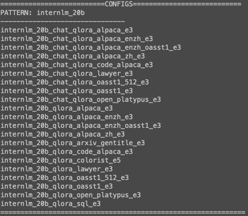
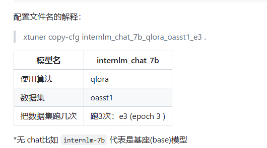

# XTuner 大模型单卡低成本微调实战
## 1、总结
- >一个大语言模型微调工具箱。由 MMRazor 和 MMDeploy 联合开发。
- > 支持多种开源模型，such as :InternLM ✅Llama，Llama2，ChatGLM2，ChatGLM3等
- > 封装程度较高，无需太多基础知识即可调用，很轻量，微调7B的LLM，显存仅为8G
- > 微调方式全面，包含全局微调，LORA, QLORA

## 2、安装
注意：Ubuntu + Anaconda + CUDA/CUDNN + 8GB nvidia显卡（最低要求）
```bash
# 如果你是在 InternStudio 平台，则从本地 clone 一个已有 pytorch 2.0.1 的环境：
/root/share/install_conda_env_internlm_base.sh xtuner0.1.9
# 如果你是在其他平台：
conda create --name xtuner0.1.9 python=3.10 -y

# 激活环境
conda activate xtuner0.1.9
# 进入家目录 （~的意思是 “当前用户的home路径”）
cd ~
# 创建版本文件夹并进入，以跟随本教程
mkdir xtuner019 && cd xtuner019


# 拉取 0.1.9 的版本源码
git clone -b v0.1.9  https://github.com/InternLM/xtuner
# 无法访问github的用户请从 gitee 拉取:
# git clone -b v0.1.9 https://gitee.com/Internlm/xtuner

# 进入源码目录
cd xtuner

# 从源码安装 XTuner
pip install -e '.[all]'
```
## 3、微调
XTuner已经为我们准备了很多训练模型时用到的配置文件，使用以下命令可查看所有的配置
```bash
# 列出所有内置配置
xtuner list-cfg
# 假如显示bash: xtuner: command not found的话可以考虑在终端输入 export PATH=$PATH:'/root/.local/bin'

```

好的，我们已经知道了有折磨多的配置文件，我们就要用起来的。使用如下命令拷贝配置文件到工作目录
```bash
mkdir workspace && cd workspace
xtuner copy-cfg internlm_chat_7b_qlora_oasst1_e3 . # 讲**配置文件拷贝的当前目录
```


有了配置文件，需要干什么呢？
需要下载预训练模型呢
开发机上下载
```bash
cp -r /root/share/temp/model_repos/internlm-chat-7b ~/workspace/
```
在线下载
```bash
# 创建一个目录，放模型文件，防止散落一地
mkdir ~/workspace/internlm-chat-7b

# 装一下拉取模型文件要用的库
pip install modelscope

# 从 modelscope 下载下载模型文件
# cd ~/ft-oasst1
apt install git git-lfs -y
git lfs install
git lfs clone https://modelscope.cn/Shanghai_AI_Laboratory/internlm-chat-7b.git -b v1.0.3
```
数据集准备
可使用tutorial中的数据集，也可以自己准备数据集
https://huggingface.co/datasets/timdettmers/openassistant-guanaco/tree/main

此时路径
```json
|-- internlm-chat-7b
|   |-- README.md
|   |-- config.json
|   |-- configuration.json
|   |-- configuration_internlm.py
|   |-- generation_config.json
|   |-- modeling_internlm.py
|   |-- pytorch_model-00001-of-00008.bin
|   |-- pytorch_model-00002-of-00008.bin
|   |-- pytorch_model-00003-of-00008.bin
|   |-- pytorch_model-00004-of-00008.bin
|   |-- pytorch_model-00005-of-00008.bin
|   |-- pytorch_model-00006-of-00008.bin
|   |-- pytorch_model-00007-of-00008.bin
|   |-- pytorch_model-00008-of-00008.bin
|   |-- pytorch_model.bin.index.json
|   |-- special_tokens_map.json
|   |-- tokenization_internlm.py
|   |-- tokenizer.model
|   `-- tokenizer_config.json
|-- internlm_chat_7b_qlora_oasst1_e3_copy.py
`-- openassistant-guanaco
    |-- openassistant_best_replies_eval.jsonl
    `-- openassistant_best_replies_train.jsonl
```
接下来就是修改配置文件了

```bash
# 修改模型为本地路径
- pretrained_model_name_or_path = 'internlm/internlm-chat-7b'
+ pretrained_model_name_or_path = './internlm-chat-7b'

# 修改训练数据集为本地路径
- data_path = 'timdettmers/openassistant-guanaco'
+ data_path = './openassistant-guanaco'
```
**常用超参**

| 参数名 | 解释 |
| ------------------- | ------------------------------------------------------ |
| **data_path**       | 数据路径或 HuggingFace 仓库名                          |
| max_length          | 单条数据最大 Token 数，超过则截断                      |
| pack_to_max_length  | 是否将多条短数据拼接到 max_length，提高 GPU 利用率     |
| accumulative_counts | 梯度累积，每多少次 backward 更新一次参数               |
| evaluation_inputs   | 训练过程中，会根据给定的问题进行推理，便于观测训练状态 |
| evaluation_freq     | Evaluation 的评测间隔 iter 数                          |

## 3、炼丹开始
CONFIG_NAME_OR_PATH 是配置文件的路径

训练代码：
- > xtuner train ${CONFIG_NAME_OR_PATH}
deepspeed加速
- >xtuner train ${CONFIG_NAME_OR_PATH} --deepspeed deepspeed_zero2

微调时间较长，请耐心等待。训练完成后会生成`./work_dirs`目录，训练的结果都将保存在里面


将训练得到的权重模型.pth转为HuggingFace模型，生成Adapter文件夹
`xtuner convert pth_to_hf ${CONFIG_NAME_OR_PATH} ${PTH_file_dir} ${SAVE_PATH}`
代码示例：
```bash
mkdir hf
export MKL_SERVICE_FORCE_INTEL=1

xtuner convert pth_to_hf ./internlm_chat_7b_qlora_oasst1_e3_copy.py ./work_dirs/internlm_chat_7b_qlora_oasst1_e3_copy/epoch_1.pth ./hf
```
此时，hf文件夹就是我们平时所理解的所谓的“LoRA模型文件”
`LoRA 模型文件 = Adapter`


### 将 HuggingFace adapter 合并到大语言模型： 
```bash
xtuner convert merge ./internlm-chat-7b ./hf ./merged --max-shard-size 2GB
# xtuner convert merge \
#     ${NAME_OR_PATH_TO_LLM} \
#     ${NAME_OR_PATH_TO_ADAPTER} \
#     ${SAVE_PATH} \
#     --max-shard-size 2GB
```
### 与合并后的模型对话：
```bash
# 加载 Adapter 模型对话（Float 16）
xtuner chat ./merged --prompt-template internlm_chat

# 4 bit 量化加载
# xtuner chat ./merged --bits 4 --prompt-template internlm_chat
```

